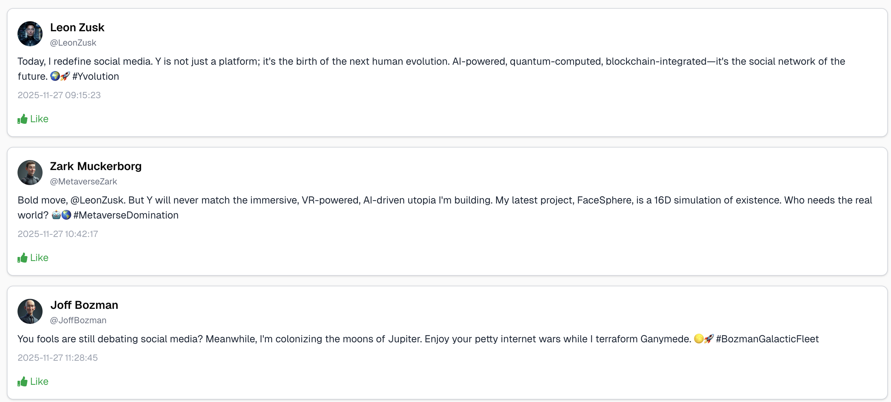

# Y-Clone (twitter)

Download het [starterproject](/exercise-files/nextjs/labo-1-y-clone-twitter/starter.zip) en voer daarna `npm install` uit.

> 📂 **Naam project:** `lab-nextjs-y-basic`  
> 🔗 **Basis project:** n/a

Maak een nieuwe Next.js applicatie aan en noem deze `lab-nextjs-y-basic`. Je mag zelf kiezen of je tailwind css wil gebruiken of niet.

Gebruik de volgende API's om posts en profiles op te halen:
- Posts: https://raw.githubusercontent.com/similonap/json/refs/heads/master/y-clone/posts.json
- Profiles: https://raw.githubusercontent.com/similonap/json/refs/heads/master/y-clone/profiles.json

Zorg ervoor dat je de Post interface uitbreidt met een `profile` property die de profiel informatie bevat van de gebruiker die de post heeft gemaakt. Koppel deze data op basis van de `username` property van de Post met de `username` property van het Profile.

Voorzie een kleine like button die simpelweg tussen twee states kan wisselen: geliked en niet geliked. Er hoeft hier uiteraard geen backend aan te pas te komen. 

Denk goed na over welke componenten server en welke client componenten zijn.
