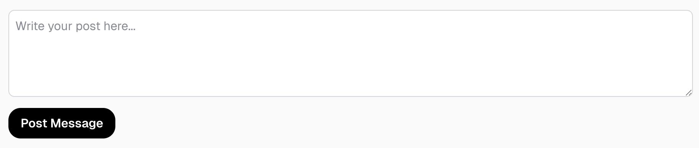

# Y-Clone (Forms) (twitter)

Download het [starterproject](/exercise-files/nextjs/labo-3-y-clone-forms-twitter/starter.zip) en voer daarna `npm install` uit.

Wanneer je klaar bent, kan je jouw uitwerking vergelijken met de [voorbeeldoplossing](/exercise-files/nextjs/labo-3-y-clone-forms-twitter/solution.zip).

> 📂 **Naam project:** `lab-nextjs-y-routing`  
> 🔗 **Basisproject:** de vereiste begincode is inbegrepen in het [starterproject](/exercise-files/nextjs/labo-3-y-clone-forms-twitter/starter.zip).

In deze oefening moet je het vorige project uitbreiden met een formulier waarmee een gebruiker een nieuwe post kan aanmaken. Er moet nog geen user authenticatie zijn, dus je kan de post aanmaken onder de naam `JonDoe`.

