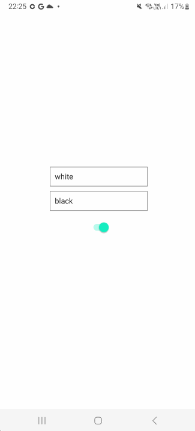

# Dark/Light Toggle

Download het [starterproject](/exercise-files/react-native/labo-3-dark-light-toggle/starter.zip) en voer daarna `npm install` uit.

Maak een nieuwe react native app. Plaats twee invoervelden in de app en een switch. ALs je op de switch duwt, veranderd de achtergrond kleur van de app initieel van wit naar zwart en omgekeerd. De invoervelden dienen om de kleur waartussen je kan switchen in te geven. De applicatie moet er als volgt uitzien:

