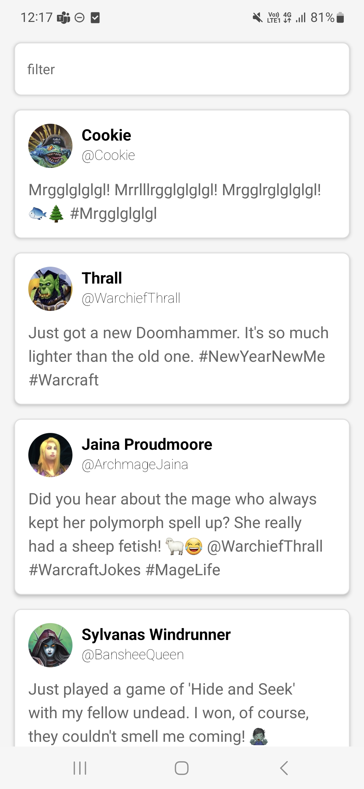

import YouTubeVideo from '@site/src/components/YouTubeVideo';

# Twitter

Download het [starterproject](/exercise-files/react-native/labo-3-twitter/starter.zip) en voer daarna `npm install` uit.

Maak een nieuwe react native app. 

Zorg dat bij het opstarten van de app twee API calls gebeuren:
- Ophalen van de tweets: https://my-json-server.typicode.com/similonap/twitter-json-server/tweets
- Ophalen van de profielen: https://my-json-server.typicode.com/similonap/twitter-json-server/profiles

Je kan dit in een DataProvider component doen en werken met een context.

Vervolgens zorg je dat de tweets in een lijst getoond worden. De lijst moet er als volgt uitzien:

Zorg er ook voor dat je een filter input veld hebt waarmee je de tweets kan filteren op basis van de naam van de auteur. De filter moet case insensitive zijn.

Voorzie een swipe down to refresh functionaliteit.

### Oplossingsvideo

<YouTubeVideo src='https://youtu.be/inSMqbQUz40'/>
