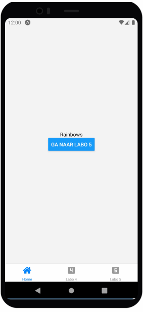

import YouTubeVideo from '@site/src/components/YouTubeVideo';

# Rainbow Navigation

Download het [starterproject](/exercise-files/react-native/labo-4-rainbow-navigation/starter.zip) en voer daarna `npm install` uit.

Ga verder met de code van labo 4 en kopieer deze naar een nieuw project.

We bouwen de volgende applicatie:

De applicatie bestaat uit drie schermen:
- Een simpel "Home" scherm met een knop die naar scherm 3 gaat
- Een scherm dat de oefening van vorige week bevat
- Een scherm met een lijst van 200 kleuren verkregen via `rainbow-colors-array-ts`

Wanneer je op een kleur drukt, krijg je een detail scherm. Dit scherm heeft als achtergrondkleur de geselecteerde kleur en toont de hex waarde in de titel en in het midden van het scherm

#### Tips:
- Gebruik const colors = rainbow(200,"hex",true); voor de 200 kleuren die je toont op het 3e scherm.
- Je hebt een custom component nodig voor de inhoud van het labo van vorige week.
- Je hebt hier een combinatie van Stack en Tab navigatie nodig.

### Oplossingsvideo

<YouTubeVideo src='https://youtu.be/TndQZTkZ9DM'/>
<YouTubeVideo src='https://youtu.be/k4qtrqS7u54'/>
