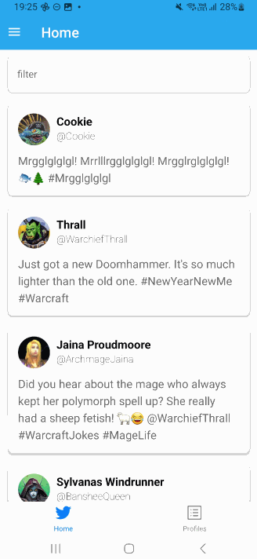
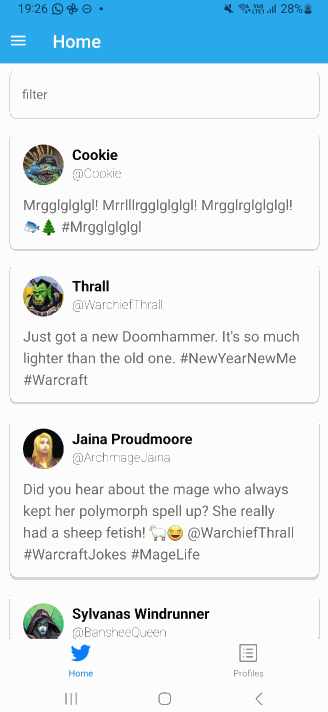
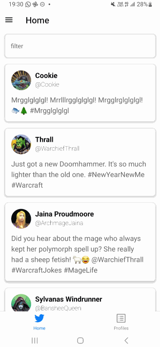

import YouTubeVideo from '@site/src/components/YouTubeVideo';

# Twitter

Download het [starterproject](/exercise-files/react-native/labo-4-twitter/starter.zip) en voer daarna `npm install` uit.

Breidt de Twitter applicatie uit met expo router. De applicatie moet een Stack navigator combineren met een Tab navigator en een Drawer navigator.

De applicatie moet de volgende schermen bevatten:
- Home: Een scherm met een lijst van tweets (vorige opgave)
- Profiles: Een scherm met een lijst van alle profielen.

Deze schermen moeten bereikbaar zijn via een tab navigator.

Als je op een profiel drukt, moet je naar een nieuw scherm gaan met de details van het profiel. Dit scherm moet bereikbaar zijn via een stack navigator (dus niet meer via de tab navigator). Het scherm zal dus boven de tab navigator komen.

Vervolgens heb je ook een drawer navigator nodig. Deze moet bereikbaar zijn via een hamburger menu in de header van het home scherm. De drawer moet momenteel enkel een settings scherm en het home scherm bevatten. De inhoud zullen we later nog uitbreiden.

### Oplossingsvideo

<YouTubeVideo src='https://youtu.be/uRG9HQudyhI'/>
<YouTubeVideo src='https://youtu.be/BizAB01eoTs'/>
