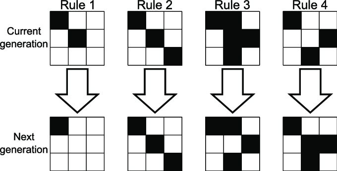

# Game of Life (2)

Download het [starterproject](/exercise-files/react/labo-6-game-of-life-2/starter.zip) en voer daarna `npm install` uit.

Wanneer je klaar bent, kan je jouw uitwerking vergelijken met de [voorbeeldoplossing](/exercise-files/react/labo-6-game-of-life-2/solution.zip).

> 📂 **Naam project:** `lab-hooks-game-of-life`  
> 🔗 **Basisproject:** de vereiste begincode is inbegrepen in het [starterproject](/exercise-files/react/labo-6-game-of-life-2/starter.zip).

Maak een kopie van de Game of Life van het vorige labo (lab-state-array-game-of-life) naar een nieuw project en noem deze `lab-hooks-game-of-life`.

Voeg een functie `step` toe die 1 stap van de Game Of Life uitvoert. Deze functie wordt aangeroepen telkens als de gebruiker op een `STEP` button klikt.

De regels van de Game of Life zijn als volgt:
- Rule 1: Een levende cel met minder dan 2 levende buren sterft (onderbevolking).
- Rule 2: Een levende cel met 2 of 3 levende buren blijft leven.
- Rule 3: Een levende cel met meer dan 3 levende buren sterft (overbevolking).
- Een dode cel met precies 3 levende buren wordt een levende cel (reproductie).

Maak ook een `PLAY` button die de `step` functie elke seconde aanroept. Maak ook een `STOP` button die dit stopt.
