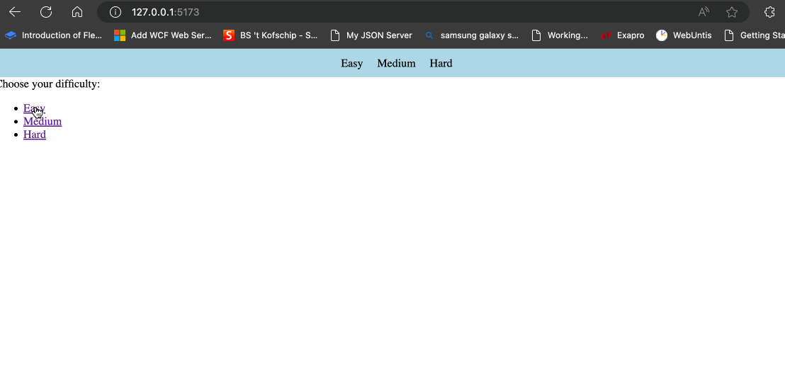

# Quiz app met React Router

Download het [starterproject](/exercise-files/react/labo-8-quiz-app-met-react-router/starter.zip) en voer daarna `npm install` uit.

> 📂 **Naam project:** n/a  
> 🔗 **Basisproject:** de vereiste begincode is inbegrepen in het [starterproject](/exercise-files/react/labo-8-quiz-app-met-react-router/starter.zip).

We gaan verder met de Quiz app uit de vorige oefening. Maak hier een kopie van zodat je de originele code nog hebt. Want we gaan hier nog wat uitbreidingen op maken. 

Uitbreidingen:
- Maak gebruik van React Router om de moeilijkheidsniveau te kiezen:
  - `/` toont de moeilijkheidsniveau's (easy, medium, hard)
  - `/quiz/:difficulty` toont de quiz met de gekozen moeilijkheidsniveau
- Zorg voor een simpele navigatiebalk waar je kan kiezen tussen de verschillende moeilijkheidsniveau's.
- Als je voor een nieuw moeilijkheidsniveau kiest, moet de quiz opnieuw beginnen.

