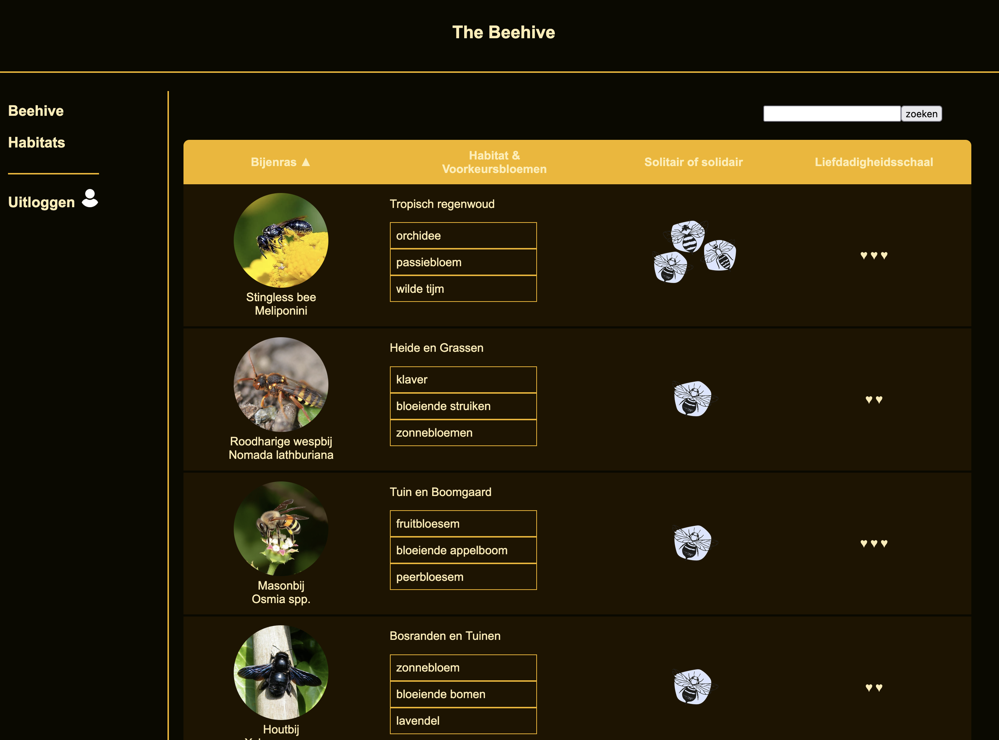

# Algemene info

Naast de labo's werk je aan een projectopdracht: een **webapplicatie rond een eigen dataset**. Je kiest zelf over welk onderwerp je data gaat (bv. kaarten uit een fantasy card game, muziekartiesten, ...). Met die data bouw je een Express-applicatie waarin gebruikers door de gegevens kunnen bladeren, filteren en sorteren, die haar data in MongoDB bewaart en die afgeschermd is met een login.

Het project is opgedeeld in milestones. De eerste twee zijn voorbereidend: je maakt je dataset en oefent ermee in een terminal-app. Vanaf milestone 2 start je met de eigenlijke webapplicatie, en die bouw je verder uit tot het einde.

## Voorbeeld van een studentenproject

:::info
Onderstaande screenshot en video tonen een project dat **door een student gemaakt is**. Het is geen opgave en geen modeloplossing, maar een illustratie van hoe een afgewerkt project eruit kan zien. Jouw onderwerp, dataset en vormgeving kies je zelf.
:::

In *The Beehive* koos de student voor een dataset over bijensoorten. Het overzicht toont de bijen in een tabel met afbeelding, habitat en voorkeursbloemen, en laat je zoeken en sorteren. Via de navigatie ga je naar de gerelateerde habitats, en de applicatie is afgeschermd met een login.

<video src={require("./assets/bees-demo.mp4").default} controls muted playsInline width="100%" />

## Hoe werkt het?

- **Eén repository.** Je werkt in een project-repo binnen de GitHub-organisatie van het vak. Hoe je die aanmaakt, lees je op de pagina [Voorbereiding](./voorbereiding.md).
- **Devcontainer.** Net als bij de labo's ontwikkel je in een devcontainer, zodat iedereen dezelfde omgeving heeft.
- **TypeScript.** Het hele project schrijf je in TypeScript.
- **Indienen.** Push je werk naar je repository en zend de link naar je repository in via Digitap. De deadlines vind je op Digitap.

:::tip
Commit en push regelmatig, niet enkel vlak voor de deadline. Zo heb je altijd een back-up en kunnen de lectoren je voortgang opvolgen.
:::

## Voorbereidende milestones

### [Milestone 0: JSON](./semester-2/milestone-0-json.md)

Je stelt je eigen dataset samen: een JSON-bestand met minstens 10 objecten, met properties van verschillende types (strings, numbers, booleans, datums, afbeeldingen, arrays, ...). Elk object verwijst ook naar een gerelateerd object uit een tweede JSON-bestand. Je host beide bestanden en je afbeeldingen publiek, bijvoorbeeld op GitHub. Deze dataset vormt de basis van de rest van het project.

### [Milestone 1: Terminal App](./semester-2/milestone-1-terminal-app.md)

Een kleine opwarmer: je schrijft de TypeScript-interfaces voor je data en maakt een console-app die de data overzichtelijk toont en laat filteren op id. Deze app bouw je later niet verder uit.

## De webapplicatie

### [Milestone 2: Express](./semester-2/milestone-2-express.md)

Je bouwt de webapplicatie met Express en EJS. De data haal je via `fetch` op uit je publieke JSON-bestand. De applicatie bevat:

- een overzichtspagina met al je objecten in een tabel, waarin je kan **filteren op naam** en **sorteren op elk veld** (oplopend en aflopend, server-side);
- een **detailpagina** per object, met afbeelding en een link naar het gerelateerde object;
- overzichts- en detailpagina's voor de gerelateerde objecten;
- een **navigatiebalk**, opgebouwd met include files.

**Je gebruikt:** Express, EJS, `fetch`, query parameters, include files

### [Milestone 3: MongoDB](./semester-2/milestone-3-mongodb.md)

Je data verhuist naar MongoDB. Bij het opstarten controleer je of de database al data bevat; zo niet, dan haal je die op via `fetch` en schrijf je ze weg. Daarna halen alle pagina's hun data uit de database. Je voegt ook een **edit-formulier** toe waarmee je minstens 4 velden van een hoofdobject kan aanpassen, waarvan minstens één via een `select`.

**Je gebruikt:** MongoDB, formulieren, CRUD-operaties

### [Milestone 4: Security](./semester-2/milestone-4-security.md)

Je schermt de applicatie af. Gebruikers kunnen registreren, inloggen en uitloggen, en wie niet ingelogd is, kan het dashboard niet bereiken. Er zijn twee rollen: een **ADMIN** mag data aanpassen, een **USER** kan enkel bekijken. Wachtwoorden sla je veilig op. Tot slot zet je de applicatie online bij een cloud provider en plaats je de link in je `README.md`.

**Je gebruikt:** authenticatie, rollen, bcrypt, hosting
